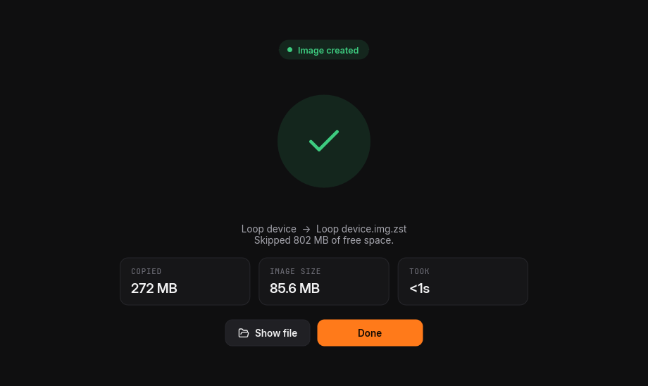

<p align="center">
  
</p>

<h1 align="center">DD-GUI</h1>

<p align="center">
  A desktop front end for <code>dd</code>: flash, back up, clone and wipe drives.<br>
  Linux, Windows and macOS. One file, nothing to install.
</p>

<p align="center">
  <a href="https://github.com/Sir-MmD/dd-gui/releases/latest">Download</a>
  &nbsp;·&nbsp;
  <a href="#building">Build from source</a>
</p>

<table>
  <tr>
    <td></td>
    <td></td>
  </tr>
  <tr>
    <td></td>
    <td></td>
  </tr>
</table>

## Features

- Write disk images to USB drives and SD cards
- Back up and clone drives, either sector by sector or used space only
- Wipe drives
- `dd` is built in, and the exact command is shown before it runs
- The system drive is protected, and every erase needs confirmation

## Smart copy

Smart copy reads the file system's allocation data and copies only the blocks in use, so a
64 GB stick holding 9 GB of data makes a 9 GB backup. Backups are saved as `.img.zst`:
DD-GUI skips the free space when writing them back, and `zstd -d` turns them into a regular
raw image.

| Supported | |
|---|---|
| File systems | FAT, exFAT, NTFS, ext2/3/4, Btrfs, XFS, F2FS, swap, APFS, HFS+, ISO 9660, UDF |
| Partitioning | MBR, GPT, Apple partition map, BSD disklabel, LVM |

Other file systems, encrypted volumes and volumes that weren't cleanly unmounted are copied
in full.

## Supported images

| | |
|---|---|
| Disk images | ISO, IMG, DMG, VHD, VHDX, VMDK, QCOW2 |
| Compressed | gz, xz, zst, bz2, lz4, lzma, zip |
| Archives | 7z, tar |

## Download

Get the archive for your system from the [latest release](https://github.com/Sir-MmD/dd-gui/releases/latest).

| Platform | File | Requires |
|---|---|---|
| Linux x86_64 | `dd-gui-<version>-linux-x86_64.tar.gz` | glibc 2.28+ (2018 or newer distributions) |
| Linux arm64 | `dd-gui-<version>-linux-arm64.tar.gz` | glibc 2.28+ |
| Windows x86_64 | `dd-gui-<version>-windows-x86_64.zip` | Windows 10 or newer |
| Windows arm64 | `dd-gui-<version>-windows-arm64.zip` | Windows 10 or newer |
| macOS Apple Silicon | `dd-gui-<version>-macos-arm64.zip` | macOS 11 or newer |

Each download holds one self-contained program. On Linux, extract it and run `./dd-gui`.

Writing to a drive needs administrator rights:
- **Linux:** DD-GUI asks through polkit, or through the tool named in `DD_GUI_ELEVATE`, such as `sudo -A`.
- **macOS:** the system password prompt appears.
- **Windows:** DD-GUI asks when it starts.

The Windows and macOS builds aren't code-signed:
- **Windows:** in SmartScreen, choose *More info* → *Run anyway*.
- **macOS:** the first time, right-click the app and choose *Open*.

## Building

Every platform needs [Rust](https://rustup.rs) 1.93 or newer. Each build script checks the
rest, offers to install what's missing, and puts the result in `dist/`.

### Linux

Needs a C compiler. The script installs one through pacman, apt, dnf or zypper if it's missing.

```sh
git clone https://github.com/Sir-MmD/dd-gui.git
cd dd-gui
./build.sh            # → dist/dd-gui
```

### macOS

Needs the Xcode Command Line Tools (`xcode-select --install`).

```sh
git clone https://github.com/Sir-MmD/dd-gui.git
cd dd-gui
./build.command       # → dist/DD-GUI.app, for this Mac's architecture
./build.command --universal   # Apple Silicon and Intel in one app
```

### Windows

Needs the Visual Studio Build Tools with the C++ workload and a Windows SDK. The script
installs them if they're missing.

```bat
git clone https://github.com/Sir-MmD/dd-gui.git
cd dd-gui
build.bat
```

The result is `dist\dd-gui.exe`. You can also double-click `build.bat`.

### Options

- `--check` runs the tests. On Windows this needs an administrator prompt.
- `--clean` rebuilds from scratch.
- `--noconfirm` skips the prompts.

### Cross-compiling

The release binaries for Linux are built with [cargo-zigbuild](https://github.com/rust-cross/cargo-zigbuild)
against glibc 2.28:

```sh
cargo zigbuild --release --target x86_64-unknown-linux-gnu.2.28
cargo zigbuild --release --target aarch64-unknown-linux-gnu.2.28
```

## Command line

```
dd-gui [IMAGE]          open the window, optionally with an image selected
dd-gui dd if=… of=…     run the bundled dd
dd-gui drives           list drives as JSON
```

## Credits

- [uutils coreutils](https://github.com/uutils/coreutils) for `dd` (MIT)
- [Zstandard](https://github.com/facebook/zstd) (BSD)
- [Slint](https://slint.dev) for the user interface (Slint Royalty-free License)
- [Inter](https://rsms.me/inter/) and [JetBrains Mono](https://www.jetbrains.com/lp/mono/) (SIL Open Font License)
- [Lucide](https://lucide.dev) icons (ISC)
