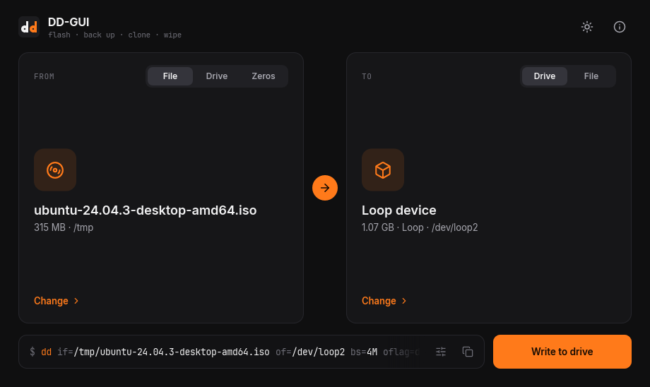
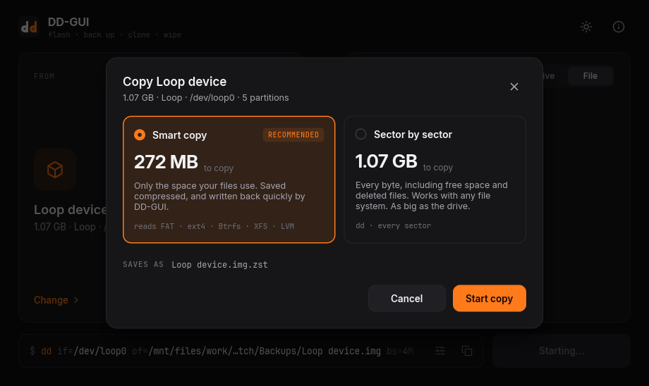
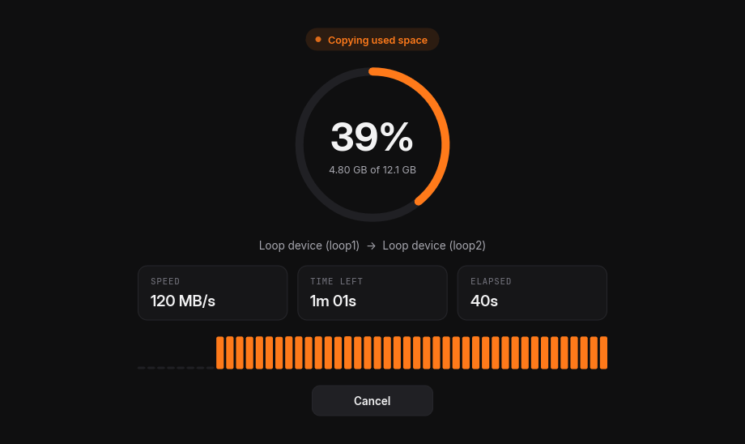

# DD-GUI

A simple, good-looking front end for `dd`, shipped as one self-contained file for Linux,
Windows and macOS. Flash an image to a USB stick, back up a drive, clone one drive to
another, or wipe one, and see exactly which `dd` command runs.





## What it does

- **Flash images to drives.**
  - Plain ISO and IMG files go through the bundled `dd`.
  - Compressed images, archives and virtual-machine disks are unpacked on the fly (see
    [Image formats](#image-formats)).
- **Back up or clone a drive, two ways.** DD-GUI reads the drive first, then asks:
  - **Smart copy** copies only the space in use, e.g. 9 GB of a 64 GB stick. Backups
    become a compressed `.img.zst` that DD-GUI writes back quickly.
  - **Sector by sector** is plain `dd`: every byte, including free space and deleted
    files. It works with any file system or encryption, and the image is as big as the drive.
- **Wipe a drive** with zeros.
- **dd options are picked for you.**
  - Block size.
  - Direct I/O on Linux, so progress follows the drive, not RAM.
  - A final flush.
  - Sparse output for backups.

  Advanced settings let you override the block size, count, skip and seek, and turn on rescue
  mode (`conv=noerror,sync`).
- **Safe by default.**
  - The drive your OS runs from can't be written to, and internal drives stay hidden until you ask.
  - Drives that are too small are flagged.
  - Writing onto the drive that holds the image is refused.
  - Every erase asks first.
  - Right before writing, the chosen drives are checked again, in case sticks were swapped or
    something got mounted.
  - Drives are unmounted (on Windows, locked) while they're copied, and mounted again afterwards.
- **One file.** `dd` from [uutils coreutils](https://github.com/uutils/coreutils) (MIT,
  GNU-compatible) is compiled in: `dd-gui dd if=… of=…` works like `dd` from a terminal.

## Smart copy

DD-GUI reads the drive's partition tables and each file system's own allocation map, and
copies only the blocks in use.

| | Read |
|---|---|
| Partition tables | MBR, GPT, Apple partition map, BSD disklabels |
| Windows | FAT12/16/32, exFAT, NTFS |
| Linux | ext2/3/4, btrfs, XFS, F2FS, swap, LVM2 (the logical volumes inside are read too) |
| Apple | APFS (including encrypted volumes), HFS+, HFSX |
| Discs | ISO 9660, UDF |

Anything else is copied in full, so nothing is ever lost:
- **Encrypted or opaque data:** LUKS, BitLocker, ZFS, ReFS, Linux RAID, bcachefs and dozens of
  other recognised formats, or unknown data.
- **File systems that look unsafe to trust:** not cleanly unmounted, a journal or log to
  replay, a failed checksum, or a feature DD-GUI doesn't know.

Partition tables, boot areas, journals, and the first and last MiB of the drive are always
copied. Each file system's reader was checked against that file system's own tools
(`btrfs check`, `xfs_repair -n`, `fsck.f2fs`, `e2fsck`, `apfsck`, `fsck.hfsplus` and more) and
file checksums: a smart copy passes them, and one with a single extent missing doesn't.

A smart image is a standard Zstandard file:
- `zstd -d backup.img.zst` (or 7-Zip, or `zstdcat backup.img.zst | dd of=/dev/sdX`) gives the
  full raw disk image, with free space as zeros.
- DD-GUI also stores a map of the used space in a frame that other zstd tools skip, so writing
  the image back with DD-GUI skips the free space.

Smart images from earlier versions (`.img.gz`) still restore.

## Image formats

| Kind | Formats |
|---|---|
| Raw | ISO, IMG, anything else |
| Compressed | gzip, xz, zstd, bzip2, lz4, lzma, zip |
| Archives (first file inside) | 7z, tar, and tar inside any of the compressed formats |
| Virtual-machine disks | DMG (raw, zlib, bzip2, LZFSE, LZMA, ADC), VHD (fixed, dynamic), VHDX, VMDK (sparse, stream-optimized), QCOW2 (v2 and v3, compressed clusters) |

Encrypted images, and virtual disks that depend on another file (differencing and
snapshot disks, backing files, split VMDKs), are refused with an explanation.

## Platforms

| | Drives listed with | Admin rights via | Before writing |
|---|---|---|---|
| Linux | `lsblk` | `pkexec` (polkit) | unmounts the partitions |
| macOS | `diskutil` | the system password prompt | `diskutil unmountDisk`, uses `/dev/rdiskN` |
| Windows | PowerShell (Storage module) | the app asks for admin at start | locks and dismounts the volumes |

Every feature works on all three. Where an OS has no tool for something (Windows has no
`/dev/zero`), DD-GUI's built-in copier does it.

Without polkit, set `DD_GUI_ELEVATE` to another tool, e.g. `DD_GUI_ELEVATE="sudo -A"` or `doas`.

## Build

```sh
cargo build --release
./target/release/dd-gui                  # or: dd-gui some-image.iso
```

You need Rust and a C compiler, for libzstd. On Linux, the binary only needs libc,
fontconfig and freetype. X11, Wayland and OpenGL are loaded at runtime if they're present,
and a software renderer is built in.

- **Linux:** there's nothing to install. On start, the binary copies its icons and a menu
  entry into `~/.local/share`, so menus, docks and the Wayland taskbar show it with its icon.
  Set `DD_GUI_NO_DESKTOP_INTEGRATION=1` to turn that off.
- **Windows:** `dd-gui.exe` carries its icon, version info and an administrator manifest.
  You can also cross-build it from Linux:

  ```sh
  cargo build --release --target x86_64-pc-windows-gnu    # needs mingw-w64
  ```
- **macOS:** CI wraps the binary in a `DD-GUI.app`.

`.github/workflows/build.yml` builds and tests all three, and runs end-to-end tests with
virtual disks (`ci/`). `packaging/README.md` covers the desktop entry, icons and app bundle.

## How it works

```
dd-gui (window, runs as you)
  └─ pkexec dd-gui copy --ask … | dd-gui dd …      (with admin rights, only when a drive is involved)
       ├─ reads the drive's layout and waits for your choice (copies from a drive)
       ├─ unmounts or locks the drives
       ├─ smart copy, image unpacking, or the bundled dd
       └─ reports progress back; Cancel works, and it stops if the window goes away
```

## Status

- **Linux:** tested end to end on practice drives (loop devices) with real file systems.
  Covered: flashing, compressed images, smart and sector-by-sector backups, smart restores
  and clones, wiping, cancelling, and failures. Results were checked with fsck and file checksums.
- **Windows:** the exe builds with its icon, version info and manifest. Its copier and dd paths
  pass under Wine. It hasn't run on a real Windows PC yet.
- **macOS:** the code compiles, but it hasn't run on a real Mac yet.
- **CI:** CI will run the Windows and macOS tests and the end-to-end scripts in `ci/` once
  GitHub Actions runs for the repository. So far it hasn't created any runs.

### A quirk in uutils dd

uutils `dd` routes writes through an unaligned buffer whenever any `conv=` option is
given. With `oflag=direct`, those writes quietly fall back to the page cache. So for drives,
DD-GUI leaves out `conv=fsync` and flushes the drive itself after dd finishes. That's why
the preview reads `dd … && sync`.

## Licenses

DD-GUI bundles:
- **dd:** uutils coreutils (MIT).
- **Compression:** Zstandard (BSD); flate2 and zlib-rs, lzma-rust2, zip, bzip2 with
  libbz2-rs-sys, lz4_flex, sevenz-rust2 and lzfse_rust.
- **UI assets:** Inter and JetBrains Mono (SIL Open Font License, see `ui/fonts/`), and
  Lucide icons (ISC, see `ui/icons/LICENSE-lucide.txt`).

The UI uses [Slint](https://slint.dev). Its royalty-free license asks for the attribution
shown in the About dialog; alternatively, you can distribute under GPLv3. `vendor/` holds
a copy of one Slint crate with a crash fixed (see `vendor/README.md`).
